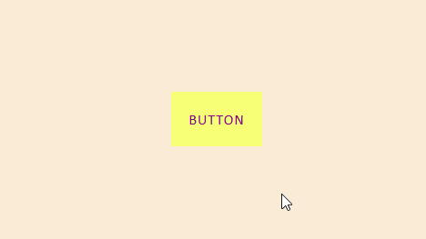

# Ui-Component-Button-Border-360
## a Simple & Elegent Button hover Effect made in HTML5 & CSS.

Just Copy CSS file and Markup to your project and Add it to desired location as per your requirment.

----------------------------------------------------------------
**TRY IT NOW**: [Button Demo](https://arslanameer.github.io/Ui-Component-Button-Border-360/)

_(Arslan Ameer)_
